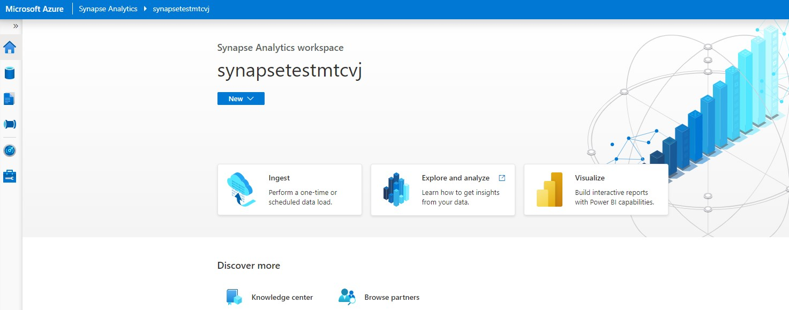
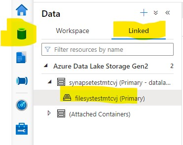
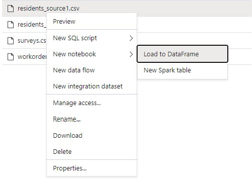
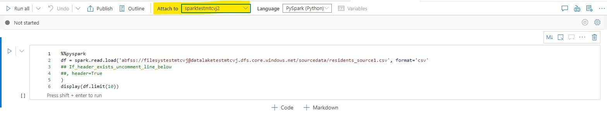
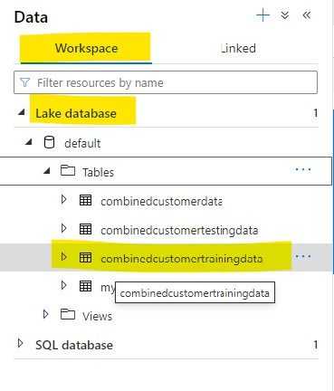
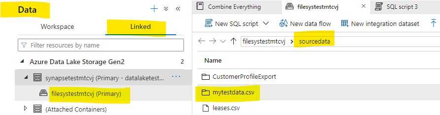
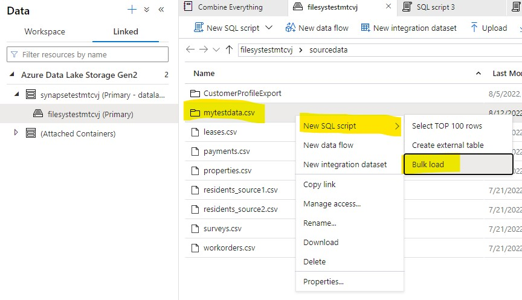
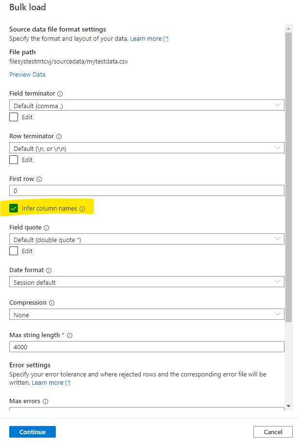
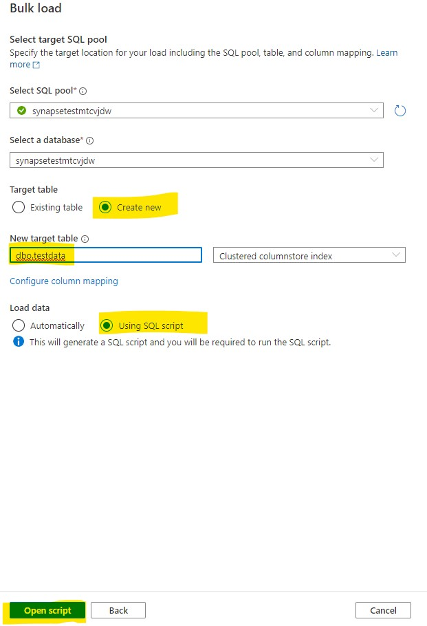
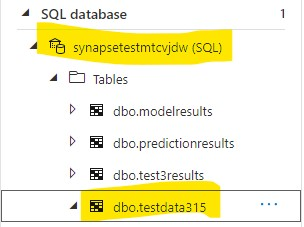

## Module 2 - Azure Synapse

### Using Synapse to wrangle a set of files

---
**Simplified for the Business User**

This set of instructions are designed with the business user or business analyst in mind. The steps are not meant to be repeatable pipeline, rather it is meant to show how a user can use Synapse to achieve a set of data wrangling outcomes, regardless of the size of data. 

---

Login to your synapse workspace. You should see something similar to the below. On the left, you can toggle between different views for scripting, viewing data, managing your clusters and more.  

Navigate to your data files. You'll find these under the Data tab on your left. Choose 'Linked' and then drill into the primary container. This will show you everything in your data lake that synapse can see.  (If you cant see any data, you can click the upload button and upload the files found in the data folder.)

Right click on any of the CSV files. This will give you the option to automatically generate code that will load it into a data frame for you to work with further. 

In your newly generated notebook, choose the spark cluster you want to use to run the notebook.
 
Once attached, you can press `shift+enter` to run the cell. The first 10 rows of the data you loaded get shown. You can toggle between table and chart views. 

---
**Notebook Cheat Sheet**

For shortcuts on navigating notebooks as well as basic info on some of the pyspark commands used [check out the Cheat Sheet](./PySparkCheatSheet.md) 

---

Once you're comfortable navigating a notebook, import the [Combine Everything notebook](./notebooks/Combine%20Everything.ipynb) and follow the instructions in each cell. This notebook walks through the logic used to examine the different files:
- Customer Profiles (that you exported in [Module 1](./Module1.md))
- Lease details
- Surveys 
- Work orders for specific maintenance carried out in any of the properties
- List of the actual properties available. 

We then shape the tables into a format suitable for Machine Learning and then combine all of this data together into one large data frame.

This final dataframe is split into 
 - Training data. Saved as a table in the Lake Database 
 - Test data saved as a CSV file _(more accurately, this gets stored as a folder full of CSV partition files that are saved as they exist in the different machines within the cluster)_ to the datalake 

We want this test data to be visible to any authenticated user for analysis purposes. So, we load this to our Synapse Dedicated SQL Pool (i.e. the massively parallel Data Warehouse). 

This is done by using the bulk load option. Find the Test Data folder in the data lake and Right Click it. Select the option to do a Bulk Load. 

The Serverless Sql pool will then attempt to preview this data for you and then give you options for the bulk loader. . Select the Infer Schema checkbox. Leave the other options as their defaults. Scroll down and Select the Linked Service and the Container from the drop down as appropriate. 

On the next screen choose to Load Data Using SQL Script, give your table a name, remembering to add your initials to the end of the table name. Then click Open Script. 

A SQL script is automatically generated that when run will create the table structure and then load the data to it.
Run this script. After a few minutes, you will be able to navigate to the table stored in the Data Warehouse _(aka the Dedicated SQL Pool)_
. Right click this table and generate the script to select the top 1000 rows. 

You are now ready to proceed to Module 3. 

