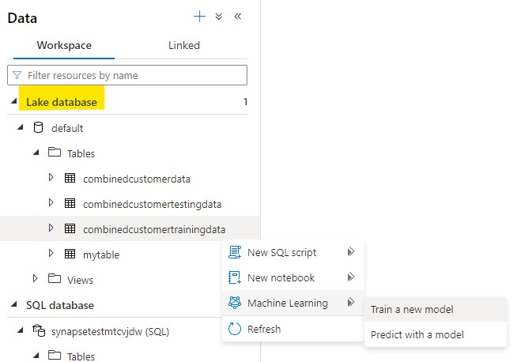
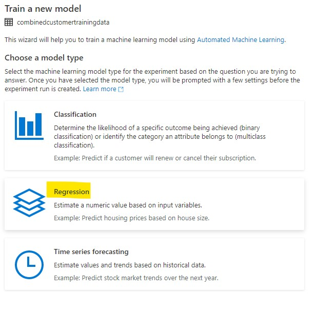
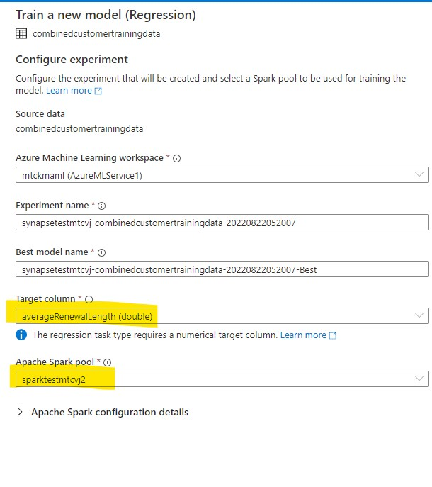
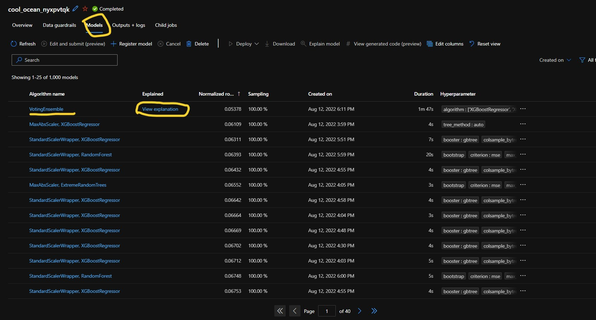
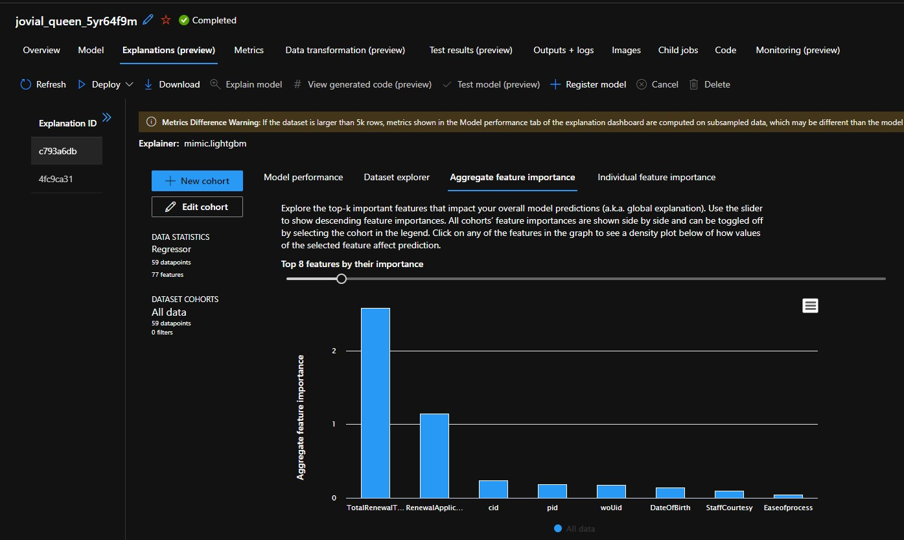
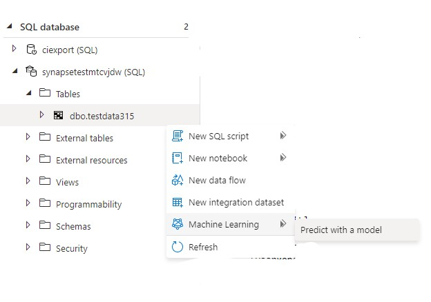
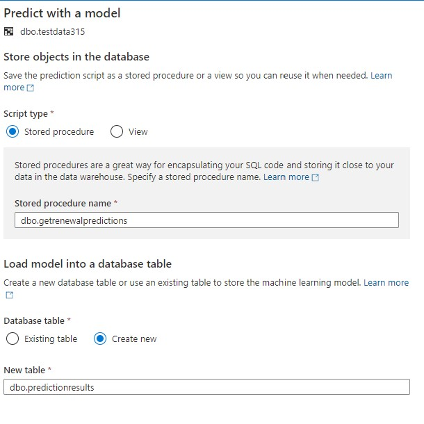
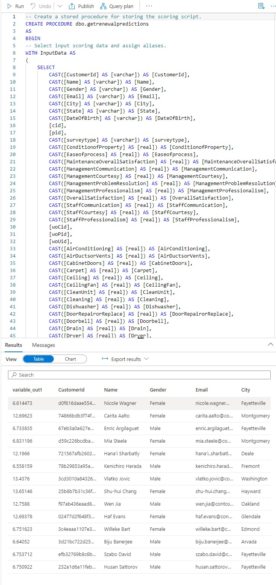
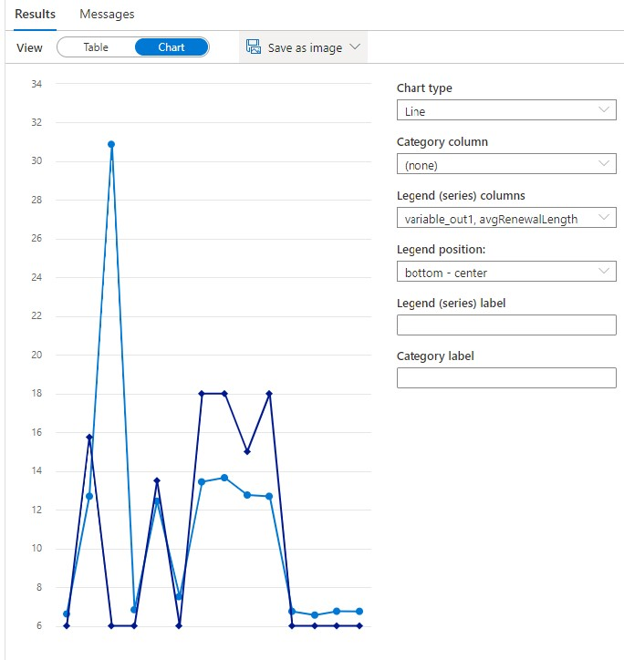

Nw# Module 3

## Azure Machine Learning

### Pre-requisites.
This only needs to be done once in an enviroment. Please [Create a linked service using the Synapse workspace Managed Identity](https://learn.microsoft.com/en-us/azure/synapse-analytics/machine-learning/quickstart-integrate-azure-machine-learning#create-a-linked-service-using-the-synapse-workspace-managed-identity)

### Using Azure Machine Learning to find the best predictive model for our business scenario

Now that we have created our training and testing datasets, lets use Azure Machine Learning from within Synapse to figure out the best model for our purposes. 

In our case, we want to predict
1. Will a Customer Renew their Lease?
2. If so, for how long for?

In addition we also want to understand the most important drivers behind lease renewals, so that we can focus management on these aspects and hopefully improve the future performance of the firm.

### Training a Model from Synapse
Since we've added a Linked Service pointing to Azure Machine Learning, we're able to use the Automated Machine Learning feature directly from Synapse

Navigate to your training data table in the Lake Database. Right Click and select "Train a New Model" under the Machine Learning menu.

On the next screen we're given the choice of three kinds of problems that can be solved using Automated Machine Learning. Since we want to predict the average renewal length, we will pick Regression.

We then want to select the target column and the available spark cluster.

Finally, we want to **(Important!)** set the Maximum Training Job Time to 1 (hour) and **(Also Important!)** Enable the ONNX model compatibility so that the DW (and other tools) can work with our model. We then want to **(Important Again!)** Open in Notebook. 

[Enable ONNX](./media3/onnxmodel.jpThis generates a notebook with PySpark code to setup an automated machine learning experiment. If needed you can tweak AutoML settings here. Run the notebook. You should get a link to the job, which you can monitor from within Azure Machine Learning Studio. 

### Understanding the outputs of the Model

Login to the Azure Machine Learning Studio, and look for the Experiment that your notebook submitted. After about an hour you should see your completed experiment. Select this experiment and choose the model tab. 

In our example over a 2 hour period, we automatically calculated a 1000 models, continously evaluating a range of techniques as well as tuning hyperparameters within these models, in an attempt to find the best model for our scenario. 

Select the Voting Ensemble Model, and check the model metrics. Go back to the Models screen and select the "Explain Model" hyperlink. Move the slider to show more drivers. You can see that aspects like age, as well as politeness of the staff actually impact the renewal length. This makes intuitive sense, but now we can also back this with data. 

### Testing a Model from Synapse

Now that we have a model, and understand what the primary drivers are, let's call the model from Synapse to score a set of customers that the model has not seen before. 

Right click the test data table from the Dedicated SQL Pool and select "Predict with a Model" and then select the model you created.

In the following screen choose a table name where the results will be stored. Because this generates a re-useable script, choose  the Stored Procedure option

There is also the option to change the default mapping of the data to the columns, after which you can generate the script and then run it. 
 

You can see the predictions results in the Variable_Out1 column. You can toggle the output to display as a chart. An example is below. 
 

Notice that the customer Eric, who hasnt renewed his initial 6 month lease yet, is predicted by our model to renew for 30 months as opposed to the usual 6/12 month renewals. Why? Because drilling into the data, we can see that Eric has just had the carpets redone, the heating fixed, and a bunch of other things sorted, which shows that he is infact likely to stay on a bit longer.

We're now ready to leverage this model within Customer Insights. 