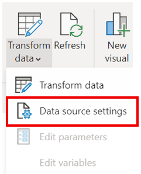

<table>
<colgroup>
<col style="width: 100%" />
</colgroup>
<thead>
<tr class="header">
<th><table>
<colgroup>
<col style="width: 90%" />
<col style="width: 9%" />
</colgroup>
<thead>
<tr class="header">
<th>
Hands-On Lab on

Dynamics 365 Customer Insights, 
Azure Synapse and Azure Machine Learning
</th>
<th></th>
</tr>
</thead>
<tbody>
</tbody>
</table></th>
</tr>
</thead>
<tbody>
</tbody>
</table>

# MODULE 4 - Bringing it all Together in Customer Insights

# Step 1: AML Custom Model 
* Navigate to Intelligence > Custom models and select "+ New workflow" 
* Provide a Name, select your tenant and Azure Machine Learning workspace, select your AML PiIpeline name for "Web service that contains your model" and click "Next

* Select the Entity for each of the "Web service input" as shown below and click "Next"

* Provide an entity name, an output data store and output path as shown below and click "Next" 

* Select "cid" for the Customer ID and click "Save"

# Step 2: Renewal Prediction Measure
* Navigate to the Measure tab, click "+ New" and select "Build your own" 
* Provide a name for your measure
* Select the "Average" function, enter `LeaseRenewalPrediction.RenewalPredictionScore * 100` in the attribute field

* Click "Save and close"

# Step 3: Set up Lease Renewal Predictions 

## Step 3.1: Load Data
In this step you will bring the Lease Renewal Preductions data into the CI environment from your Azure Synapse Workspace. 
1. In the CI environment, navigate to the Data > Data Source
2. Select `Add Data Source` and select `Azure data lake storage`, provide `predictions` for the data source name and click "Next". 

 

3. Under "Connect your storage account using" select `Azure subscription`, select your `subscription`, `resource group` and the `Synapse workspace storage account` you are using for this solution. Enter `data` for the Container

4. Select the `synapse` folder, select `default.manifest.cdm.json` and click "Next"

5. Select all model entities and click "Next"
6. Select all entities to enable data profiling and select "Save"

## Step 3.2: Set up Relationship 
1. Provide a name for the relationship 
2. Under Source details select `LeaseResewalPrediction:predictions` for "Entity", `One` for "Cardinality" and `CustomerId` for "Source field"
3. Under Target details select `Customer:CustomerInsights` for "Entity", `One` for "Cardinality" and `CustomerId` for "Target field" and click "Save"

## Step 3.3: Measure Lease Renewal Predictions 
1. Navigate to the Measure tab, click "+ New" and select "Build your own" 
2. Select "Dimensions", click the trash can icon to remove the dimension and click "Apply" 
3. Select "Edit name" and provide `Lease Renewal Predictions` for your measure name
4. Select "Edit name" under the Calculation, provide `Lease Renewal Predictions` for the calculation name and click "Done" 
5. Select `First` from the drop down 
6. Select "+ Add attribute", select `predictions_lease_renewal_prediction.RenewalPrediction` from the attributes list and click "Add"
6. Click "Save and close" 
7. Select Edit on the "Lease Renewal Predictions"  
8. Select "Dimensions", select `CustomerInsights.CustomerId` and select "Apply"  
9. Select "Relationship path", select `predictions_lease_renewal > Customer` and select "Done"
10. Select "Run" 

# Step 4: Power BI Set Up 
1. Open the [Power BI report](https://github.com/microsoft/Azure-Synapse-Customer-Insights-Customer360-Solution-Accelerator/tree/main/Report/Customer360Dashboard.pbix) in this repository

2. Click the Transform data dropdown and click Data source settings 

3. Select the Azure Synapse Workspace connection, select "Change Source..." and provide your SQL Server Database name under Server and click "OK" 
    * Navigate to the Synapse Workspace overview page in the Azure Portal, copy the Serverless SQL endpoint
4. Select "Edit Permissions", under Credentials select "Edit", sign in to your Microsoft Account, click "OK" and click "Close"
5. Click Transform data dropdown and click Transform data

6. Select UnifiedActivity on the left under Queries, select Home and click Advanced editor

7. Replace InstanceId with your CI instance ID and click "Done" 
    * Navigate to your CI environment and copy the instance id in the URL of the webpage

8. Repeat step 7 for the Customer, LeaseRenewalPredictions, SalesOrderLine, Customer_Measure, InterestAffinityFromMicrosoft, BrandAffinityFromMicrosoft, LeasesEndingin90Days, Subscription and TTV queries
9. Select Home and click "Close & Apply" 
10. Click Refresh Data 

