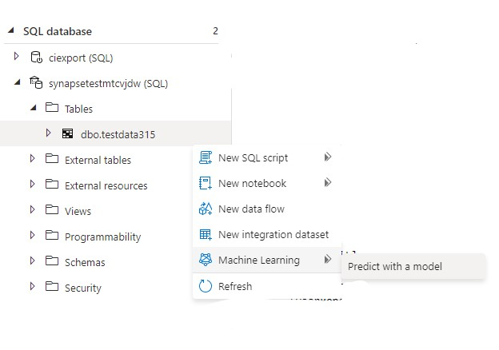
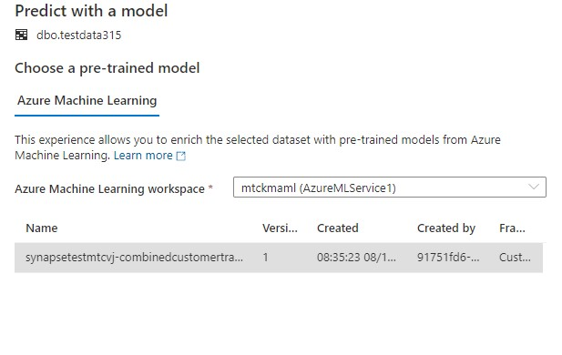
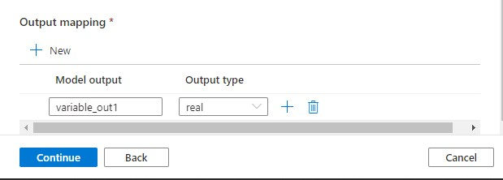
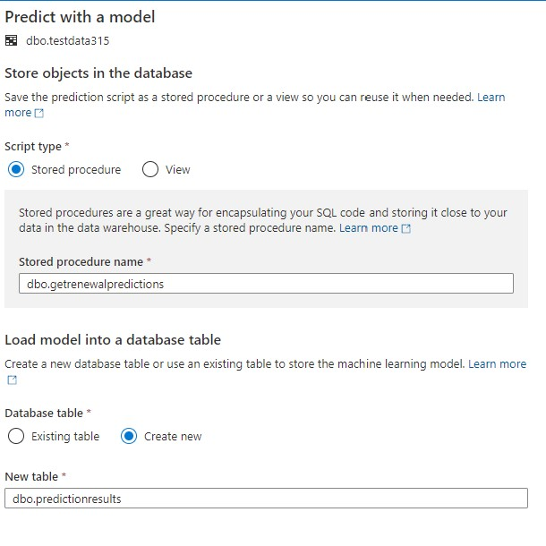
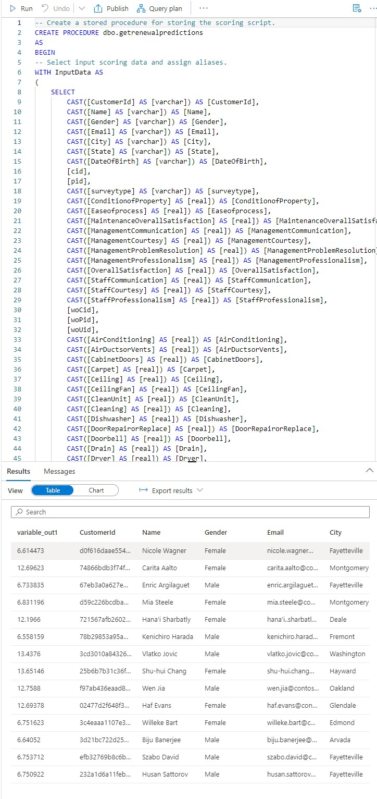
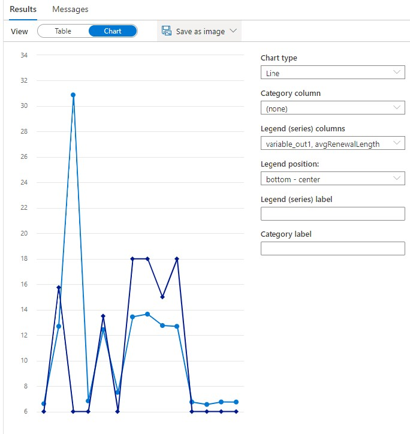
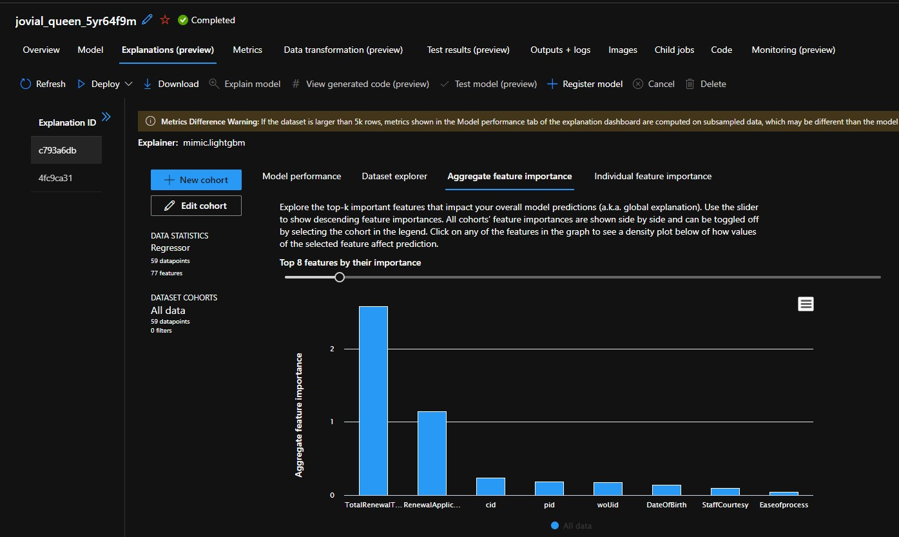
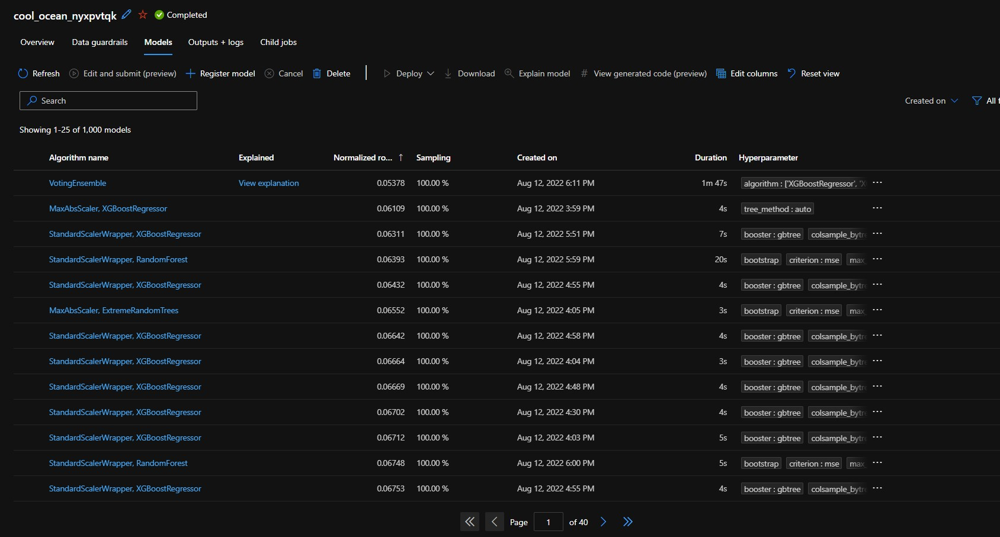

# CI-Synapse-AML-HandsOn
A Hands On Tutorial on using Dynamics 365 Customer Insights, Azure Synapse and Azure Machine Learning together

|  |
|------------------------------------------------------------------------------------------------------------------------------------------------------|

<table>
<colgroup>
<col style="width: 90%" />
<col style="width: 9%" />
</colgroup>
<thead>
<tr class="header">
<th>
Hands-On Lab

Customer Insights, Synapse and Azure Machine Learning
</th>
<th></th>
</tr>
</thead>
<tbody>
<tr class="odd">
<td>Agenda</td>
<td></td>
</tr>
<tr class="even">
<td><strong>Introduction</strong></td>
<td><strong>30 mins</strong></td>
</tr>
<tr class="odd">
<td>
<strong>Dynamics 365 Customer Insights</strong>

<ul>
<li>
Using CI to Cleanse &amp; Enrich a set of Customer Records 
</li>
</ul></td>
<td><strong>4 hours</strong></td>
</tr>
<tr class="even">
<td>
<strong>Azure Synapse</strong>

<ul>
<li>
Using Synapse to wrangle a set of files 
</li>
</ul></td>
<td><strong>8 hours</strong></td>
</tr>
<tr class="odd">
<td>
<strong>Azure Machine Learning</strong>

<ul>
<li>
Using Azure Machine Learning to find the best predictive model for our business scenario. 
</li>
</ul></td>
<td><strong>2 hours</strong></td>
</tr>
<tr class="even">
<td><strong>Putting it all together</strong></td>
<td><strong>2 hours</strong></td>
</tr>
<tr class="odd">
<td><ul>
<li>
Using CI to navigate, segment, and predict behavior across our final customer dataset.
</li>
</ul></td>
<td></td>
</tr>
</tbody>
</table>

Introduction

Add blurb here

Dynamics 365 Customer Insights

Add Dynamics Content here

AZURE SYNAPSE

Now that you’ve exported the profiled customers from Customer Insights,
lets create a larger dataset that we can use to predict if a customer
will renew their lease agreement, and for how long.

In order to predict this we need to add as much information as possible.
Here we will combine the datasets describing

-   Customers (you used CI in the previous step to create this cleaned
    and enriched set.)

-   Leases

-   Properties

-   Workorders

-   Surveys

In your synapse studio, we will examine each file individually, decide
what elements we want to keep and combine. You can load any file to the
spark cluster, by right clicking it and selecting “load to data frame”.
This will create a PySpark notebook for you. Attach this notebook to the
cluster and run the notebook. You should see a table generated in the
cell below. The display() command creates these results which can be
changed to a chart as well. Once you’ve seen what the dataset has, lets
load the others in and combine them into a table that we want. Some
tables require additional steps like pivoting , grouping, renaming, and
conditionally changing values or adding new calculations. To help you
with this, an example notebook has been created with all the steps in
it, but you may need to adjust to your selected datasets/columns as
required. A cheat sheet has also been created with helpful hints. Where
possible we use the simplest approaches which are also scalable.

-   Notebook that combines all the datasets

-   Cheatsheet

Please work your way through the notebook, referring to the cheatsheet
if necessary. Once you have created your final tables, you can continue
to the next step of building a Machine Learning Model that can be
consumed by Customer Insights.

Azure MAchine LEarning

Add AML content here 

